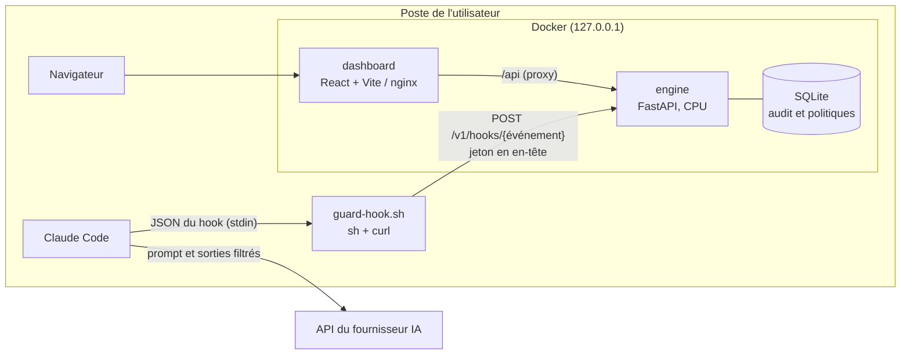
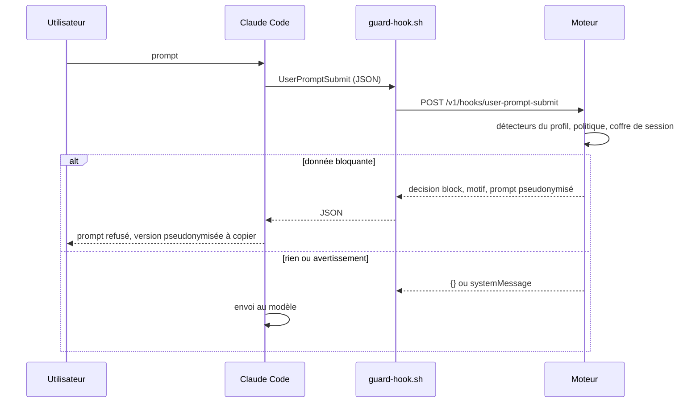

# Dossier d'architecture technique : RGPD Guard

Ce document décrit l'architecture cible de la version 0.1.0 et l'état réel de chaque brique.
Le découpage et l'état d'avancement vivent dans [le backlog](BACKLOG.md) ; les décisions et leurs motifs dans [le journal](JOURNAL.md).

## 1. Objet et périmètre

RGPD Guard est un plugin Claude Code qui empêche d'envoyer au modèle des données personnelles (au sens du RGPD, y compris les catégories particulières de l'article 9) et des secrets techniques. Toute la détection s'exécute localement, sur CPU, sans service tiers.

Ce que le produit couvre :
- le texte des prompts saisis ou collés et les arguments des commandes slash ;
- les sorties d'outils transmises au modèle (fichiers lus, commandes, recherches, outils MCP) ;
- la réinjection locale des valeurs réelles lorsque Claude écrit des fichiers.

Ce que le produit ne couvre pas (limites détaillées au [§12](#compromis)) : images collées, contenus que Claude Code injecte sans hook (CLAUDE.md, mémoire, état git), télémétrie de l'outil, contenu analysé côté serveur par WebFetch.

## 2. Composants

| Composant | Rôle | Technologie |
|---|---|---|
| `plugins/rgpd-guard` | Plugin Claude Code : déclaration des hooks, client `guard-hook.sh`, commandes slash | JSON, POSIX sh, curl |
| `.claude-plugin/marketplace.json` | Marketplace `p2enjoy` publiée par ce dépôt | JSON |
| `engine/` | Moteur de détection, pseudonymisation, politiques, audit, API | Python 3.12, FastAPI, uvicorn |
| `dashboard/` | Interface d'administration locale | React, Vite, TypeScript, Lucide |
| `seeds/` | Générateur déterministe du corpus et des données de démonstration | Python, Faker |
| `e2e/` | Tests de bout en bout : Claude Code réel avec faux serveur API, Playwright | Python, TypeScript |

## 3. Contrat Claude Code

Les faits suivants proviennent de la documentation officielle des hooks et des formes réelles relevées dans les transcripts locaux ; ils sont confirmés par la capture M1 consignée dans le journal.

| Événement | Ce que le moteur peut faire | Utilisation |
|---|---|---|
| `SessionStart` | ajouter du contexte, message système | consigne de conservation des jetons, état du moteur |
| `UserPromptSubmit` | bloquer (`decision: block`), masquer le prompt dans le message (`suppressOriginalPrompt`), ajouter du contexte ; ne peut pas réécrire le prompt | blocage et proposition pseudonymisée |
| `UserPromptExpansion` | bloquer l'expansion d'une commande slash | même traitement que le prompt |
| `PreToolUse` | `permissionDecision` allow, deny, ask ; `updatedInput` | fichiers secrets, réhydratation, refus si moteur absent |
| `PostToolUse` | `updatedToolOutput` remplace ce que Claude voit, à condition de respecter la forme exacte de la sortie de l'outil | pseudonymisation des sorties |
| `PostToolUseFailure` | ajouter du contexte seulement | journalisation de fuite probable |
| `PostToolBatch` | voit le contenu sérialisé exact envoyé au modèle ; `decision: block` arrête la boucle avant l'appel | filet de sécurité |
| `SubagentStart` | ajouter du contexte au sous-agent | consigne de conservation des jetons |

Délais : 30 s par défaut sur `UserPromptSubmit` ; un hook qui dépasse son délai est ignoré et le prompt part. Les délais sont donc emboîtés : délai du hook, puis `curl --max-time` plus court, puis échéance interne du moteur plus courte encore, au-delà de laquelle seul le profil `rapide` s'applique.

Un hook de type `http` laisse passer en cas d'échec de connexion ; le plugin utilise donc un hook `command` qui sait bloquer lui-même (voir [§5](#client-hook)).

## 4. Flux

### 4.1 Prompt

Contournement : un prompt qui commence par `#rgpd-ok` passe, sauf s'il contient un secret ; le contournement est journalisé.

### 4.2 Sorties d'outils

1. `PreToolUse` : refus des fichiers secrets ; refus de tout outil si le moteur est absent et `fail_mode=closed`.
2. L'outil s'exécute localement.
3. `PostToolUse` : le moteur parcourt `tool_response`, remplace chaque feuille texte (hors clés techniques : chemins, types, identifiants, compteurs) par sa version pseudonymisée et renvoie la structure complète dans `updatedToolOutput`.
4. `PostToolBatch` : le moteur recontrôle le contenu sérialisé final avec le profil `rapide` ; une donnée résiduelle bloque la boucle avant l'appel au modèle, avec la consigne d'utiliser `/rewind`.

### 4.3 Réhydratation

Lorsque Claude écrit (`Write`, `Edit`, `MultiEdit`, `NotebookEdit`) ou désigne un chemin (`Read`, `Grep`, `Glob`) avec des jetons `⟦TYPE_N⟧`, `PreToolUse` les remplace par les valeurs d'origine exactes via `updatedInput`. La décision est `allow` en mode `bypassPermissions` ou `acceptEdits`, `ask` sinon, afin de ne jamais accorder une permission que l'utilisateur n'aurait pas donnée. Un jeton inconnu (coffre expiré, moteur redémarré) entraîne un refus : aucun jeton n'est jamais écrit sur disque. Bash, WebFetch, WebSearch et MCP ne sont jamais réhydratés, car ce serait une voie d'exfiltration. La sortie de l'outil d'écriture, qui contient alors les vraies valeurs, repasse par `PostToolUse`.

## 5. Client de hook `guard-hook.sh`

- POSIX `sh` et `curl` uniquement ; exécuté en forme exec par Claude Code (`sh` sous Linux, macOS et Git Bash sous Windows).
- Lit le JSON sur l'entrée standard dans un fichier temporaire, le transmet tel quel au moteur et recopie la réponse.
- Jeton transmis par un fichier d'en-têtes temporaire en mode 600, jamais en argument de commande.
- `curl --noproxy '*'` : le moteur local ne passe jamais par un proxy d'entreprise.
- Résolution de la cible, par ordre de priorité : options du plugin (`CLAUDE_PLUGIN_OPTION_ENGINE_URL`, `CLAUDE_PLUGIN_OPTION_ENGINE_TOKEN`), variables `RGPD_GUARD_URL` et `RGPD_GUARD_TOKEN`, fichier `~/.config/rgpd-guard/engine.env` écrit par le dernier lanceur démarré (lu sans être exécuté).
- Repli en cas d'échec (moteur absent, réponse non 2xx, délai dépassé, curl absent) selon `fail_mode` :

| Événement | `closed` (défaut) | `open` |
|---|---|---|
| UserPromptSubmit, UserPromptExpansion | blocage avec consigne de démarrage | message système d'avertissement |
| PreToolUse | refus de l'outil | message système |
| PostToolBatch | blocage de la boucle | message système |
| PostToolUse, PostToolUseFailure, SessionStart, SubagentStart | message système | message système |

## 6. Moteur de détection

### 6.1 Détecteurs et classificateurs

| Nom | Type | Profils | Contenu |
|---|---|---|---|
| `rules` | spans | tous | email, téléphone (phonenumbers), IBAN, carte bancaire, NIR, SIREN, SIRET (python-stdnum), IP publique, plaque SIV, date de naissance contextuelle, adresse postale FR, URL sensible |
| `secrets` | spans | tous | préfixes de fournisseurs, JWT, clés PEM, affectations à forte entropie |
| `spacy` | spans | `equilibre`, `max` | `fr_core_news_md`, `en_core_web_md` : personnes, lieux |
| `gliner` | spans | `max` | `urchade/gliner_multi_pii-v1`, labels zero-shot |
| `laya` | catégories | `equilibre` (prompts), `max` (prompts et sorties) | `convaiinnovations/laya-multilingual`, questions `noul` calibrées |

Un détecteur produit des spans `(début, fin, type, score, détecteur, validé)`. Un classificateur produit des catégories `(catégorie, probabilité)`.

### 6.2 Taxonomie

Types de spans : `PERSONNE`, `EMAIL`, `TELEPHONE`, `ADRESSE`, `IBAN`, `CARTE_BANCAIRE`, `NIR`, `SIREN`, `SIRET`, `IP`, `PLAQUE`, `DATE_NAISSANCE`, `URL_SENSIBLE`, `SECRET`, `LIEU`, `ORGANISATION`.

Catégories sensibles : `SANTE`, `OPINION_POLITIQUE`, `RELIGION`, `ORIENTATION_SEXUELLE`, `ORIGINE_ETHNIQUE`, `SYNDICAT`, `JUDICIAIRE`, `DONNEES_RH`, `MINEUR`, `CONFIDENTIEL`.

### 6.3 Fusion

1. Les jetons `⟦...⟧` déjà présents sont exclus de la détection.
2. Les spans qui se recouvrent sont départagés : span validé par somme de contrôle, puis score le plus élevé, puis span le plus long.
3. La liste blanche (valeurs exactes et motifs) retire les spans correspondants.
4. Les spans sous le score minimal de leur type sont ignorés.

### 6.4 Mode code

Pour un fichier source (selon son extension) et pour les blocs de code délimités d'un prompt, seuls `rules` et `secrets` s'appliquent : la NER produit trop de faux positifs sur les identifiants de code.

## 7. Profils et politiques

| Profil | Détecteurs | Cible de latence |
|---|---|---|
| `rapide` | rules, secrets | moins de 20 ms |
| `equilibre` (défaut) | rapide, spacy, laya sur les prompts | moins de 600 ms par prompt |
| `max` | equilibre, gliner, laya sur les sorties | mesurée par le banc |

Politique (fichier par défaut `engine/policies/default.yaml`, surcharges persistées en base) :
- par type de span : action sur prompt (`block`, `warn`, `allow`), action sur sortie (`pseudonymize`, `allow`), score minimal ;
- par catégorie : seuil de probabilité et action (`block_if_identifier`, `warn`, `allow`) ;
- liste blanche de valeurs et de motifs ;
- motifs de fichiers secrets ;
- types autorisés au contournement (`SECRET` exclu sans exception).

Règle d'escalade des catégories : une catégorie sensible au-dessus de son seuil bloque le prompt si un identifiant direct (personne, email, téléphone, NIR...) est présent dans le même texte, sinon elle produit un avertissement.

## 8. Pseudonymisation et coffre

- Format des jetons : `⟦TYPE_N⟧` (crochets mathématiques U+27E6 et U+27E7), `N` croissant par type et par session.
- La même valeur exacte reçoit le même jeton pendant toute la session.
- Coffre en mémoire du processus moteur, indexé par `session_id`, durée de vie glissante (12 h par défaut), purge périodique. Il n'est ni écrit sur disque ni exposé par l'API d'administration. Un seul worker uvicorn porte le coffre ; l'accès est protégé par verrou.
- Un redémarrage du moteur vide le coffre : les jetons antérieurs deviennent inconnus et toute réhydratation est refusée.

## 9. Modèle de données

Schéma détaillé et migrations : [SCHEMA.md](SCHEMA.md).
- `audit_events` : horodatage, empreinte de session, événement, outil, décision, profil, latence, entités (type, détecteur, score, HMAC, aperçu masqué optionnel), catégories, contournement. Aucune valeur brute.
- `policies` : version, document JSON validé, date de mise à jour.
- `schema_migrations` : migrations appliquées.

Le journal d'audit est lui même un traitement de données personnelles (minimisé) : clé HMAC locale fournie par l'environnement, aperçu masqué désactivé par défaut en production, rétention de 30 jours par défaut.

## 10. Interfaces

| Méthode et chemin | Accès | Rôle |
|---|---|---|
| `GET /health` | public | état, version, détecteurs prêts |
| `POST /v1/hooks/{event}` | jeton | adaptateur d'événement Claude Code |
| `POST /v1/analyze` | jeton ou session | analyse d'un texte (bac à sable, commande `/rgpd-guard:scan`) |
| `POST /v1/auth/session`, `DELETE /v1/auth/session` | jeton, session | ouverture et fermeture de session dashboard |
| `GET /v1/audit/events`, `GET /v1/audit/stats` | session | journal paginé, statistiques |
| `GET /v1/policies`, `PUT /v1/policies` | session | lecture et écriture validée de la politique |
| `GET /v1/engines` | session | état des détecteurs et dernier banc d'évaluation |

## 11. Authentification, autorisation et sécurité

- Jeton unique par environnement (`RGPD_GUARD_TOKEN`). En production, `runProd.sh` le génère s'il est absent, l'écrit dans le fichier d'environnement ignoré par git et dans `~/.config/rgpd-guard/engine.env` (mode 600).
- Hooks et API : en-tête `X-RGPD-Guard-Token`, comparaison à temps constant.
- Dashboard : connexion par saisie du jeton, cookie de session `HttpOnly`, `SameSite=Strict`, sans date d'expiration persistante, sessions en mémoire.
- Protection contre la falsification de requêtes et le DNS rebinding : liste blanche de l'en-tête Host, contrôle de l'origine sur les requêtes modifiantes, corps JSON obligatoire, CORS limité à l'origine du dashboard.
- Conteneurs non root, système de fichiers en lecture seule, `HF_HUB_OFFLINE=1`, ports publiés uniquement sur 127.0.0.1 (moteur 8742, dashboard 8743 ; staging 18742 et 18743). Le port 8765, utilisé par le plugin AISafe de Maya Data Privacy, est évité.
- Journalisation applicative : jamais de valeur détectée, de prompt ni de jeton.

## 12. Déploiement, reprise et environnements

| Environnement | Fichiers | Données |
|---|---|---|
| dev | `docker-compose.yml` + `docker-compose.dev.yml`, `config/environments/dev.env` | jeton fixe de développement, seed automatique, rechargement à chaud |
| staging | `docker-compose.yml` + `docker-compose.staging.yml`, `config/environments/staging.env` | images de production, seed de démonstration |
| prod | `docker-compose.yml` + `docker-compose.prod.yml`, `config/environments/prod.env` | aucune donnée seedée |

Reprise : la base SQLite vit dans un volume nommé ; sa perte n'efface que le journal et les surcharges de politique (la politique par défaut est dans l'image). Le coffre de pseudonymes est volontairement volatil.

## 13. Choix techniques et compromis

- Détection locale sur CPU uniquement : aucun appel réseau à l'exécution, modèles intégrés à l'image.
- spaCy français sous licence LGPL-LR : modèle téléchargé à la construction de l'image, jamais versionné dans le dépôt.
- Laya ne localise pas les spans : il qualifie le caractère sensible du texte, les spans sont pseudonymisés par les autres détecteurs.
- Limites connues : images collées, contenus injectés sans hook, télémétrie de Claude Code (désactivable par `DISABLE_TELEMETRY=1`), contenu analysé côté serveur par WebFetch, sortie d'une commande en échec visible par le seul filet `PostToolBatch`, transcript local qui conserve le texte d'un prompt bloqué.

## 14. Dépendances structurantes

Les licences sont recensées dans `THIRD_PARTY_NOTICES.md` au fur et à mesure de leur introduction.
