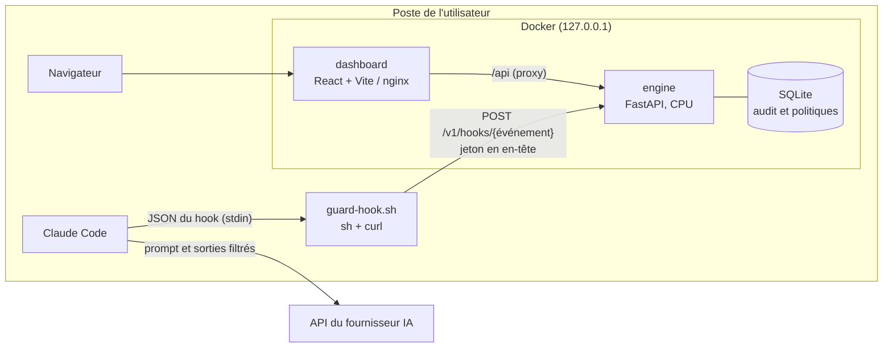
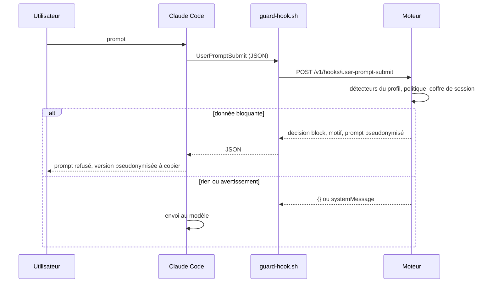

# Dossier d'architecture technique : RGPD Guard

Ce document décrit l'architecture cible de la version 0.1.0 et l'état réel de chaque brique.
Le découpage et l'état d'avancement vivent dans [le backlog](BACKLOG.md) ; les décisions et leurs motifs dans [le journal](JOURNAL.md).

## 1. Objet et périmètre

RGPD Guard est un plugin Claude Code qui empêche d'envoyer au modèle des données personnelles (au sens du RGPD, y compris les catégories particulières de l'article 9) et des secrets techniques. Toute la détection s'exécute localement, sur CPU, sans service tiers.

Ce que le produit couvre :
- le texte des prompts saisis ou collés et les arguments des commandes slash ;
- les sorties d'outils transmises au modèle (fichiers lus, commandes, recherches, outils MCP) ;
- la réinjection locale des valeurs réelles lorsque Claude écrit des fichiers.

Ce que le produit ne couvre pas (limites détaillées au [§14](#compromis)) : images collées, contenus que Claude Code injecte sans hook (CLAUDE.md, mémoire, état git), télémétrie de l'outil, contenu analysé côté serveur par WebFetch.

## 2. Composants

| Composant | Rôle | Technologie |
|---|---|---|
| `plugins/rgpd-guard` | Plugin Claude Code : déclaration des hooks, client `guard-hook.sh`, commandes slash | JSON, POSIX sh, curl |
| `.claude-plugin/marketplace.json` | Marketplace `p2enjoy` publiée par ce dépôt | JSON |
| `engine/` | Moteur de détection, pseudonymisation, politiques, audit, API | Python 3.12, FastAPI, uvicorn |
| `dashboard/` | Interface d'administration locale | React, Vite, TypeScript, Lucide |
| `seeds/` | Générateur déterministe du corpus et des données de démonstration | Python, Faker |
| `e2e/` | Tests de bout en bout : Claude Code réel avec faux serveur API, Playwright | Python, TypeScript |

## 3. Contrat Claude Code

Les faits suivants proviennent de la documentation officielle des hooks et de la capture réelle M1 (Claude Code 2.1.287, faux serveur API) consignée dans le [journal](JOURNAL.md). Les payloads réels nettoyés servent de fixtures : `engine/tests/fixtures/hooks/`.

| Événement | Ce que le moteur peut faire | Utilisation |
|---|---|---|
| `SessionStart` | ajouter du contexte, message système | consigne de conservation des jetons, état du moteur |
| `UserPromptSubmit` | bloquer (`decision: block`), masquer le prompt dans le message (`suppressOriginalPrompt`), ajouter du contexte ; ne peut pas réécrire le prompt | blocage et proposition pseudonymisée |
| `PreToolUse` | `permissionDecision` allow, deny, ask ; `updatedInput` (seul, il laisse s'appliquer les règles de permission normales à l'entrée modifiée) ; s'exécute après la validation propre de l'outil | fichiers secrets, réhydratation, refus si moteur absent |
| `PostToolUse` | `updatedToolOutput` remplace ce que Claude voit, à condition de respecter la forme exacte de la sortie de l'outil | pseudonymisation des sorties |
| `PostToolUseFailure` | ajouter du contexte seulement ; `error` contient « Exit code N » suivi de la sortie | journalisation de fuite probable, consigne d'édition |
| `PostToolBatch` | voit le contenu sérialisé exact envoyé au modèle, sorties en échec comprises ; `decision: block` arrête la boucle avant l'appel (aucune requête émise) | filet de sécurité |
| `SubagentStart` | ajouter du contexte au sous-agent (les hooks d'outils des sous-agents portent le même `session_id` et un `agent_id`) | consigne de conservation des jetons |

Points mesurés qui structurent le design :
- le contenu d'un fichier mentionné par `@chemin` est injecté dans la requête sans aucun hook d'outil ; seul `UserPromptSubmit` voit la mention ;
- `UserPromptSubmit` reçoit le texte brut des commandes slash, arguments compris : `UserPromptExpansion` n'est pas utilisé ;
- la validation d'Edit (`old_string` présent dans le fichier) précède `PreToolUse` : un `old_string` contenant un jeton échoue avant toute réhydratation ;
- Write, Edit, MultiEdit et NotebookEdit ne renvoient au modèle qu'un message de succès fixe ;
- cette version n'expose pas d'outils Grep ni Glob.

Délais : 30 s par défaut sur `UserPromptSubmit` ; un hook qui dépasse son délai est ignoré et le prompt part. Chaque hook déclare donc un délai supérieur au `curl --max-time` de son client, qui bloque lui-même à l'expiration. Pour les hooks qui analysent un texte (`UserPromptSubmit`, `PostToolUse`, `PostToolUseFailure`, `PostToolBatch`), l'échéance interne du moteur (15 s, au-delà de laquelle seuls les détecteurs sans modèle s'appliquent) est elle-même plus courte que ce `max-time` (25 s ou 55 s). `SessionStart`, `SubagentStart` et `PreToolUse` ne lancent aucune détection (consigne de contexte, refus d'un fichier secret, réhydratation) : leur `max-time` plus court (5 s et 10 s) n'a pas à contenir cette échéance. Un test du client vérifie cet emboîtement à partir de `hooks.json`.

Un hook de type `http` laisse passer en cas d'échec de connexion ; le plugin utilise donc un hook `command` qui sait bloquer lui-même (voir [§5](#client-hook)).

## 4. Flux

### 4.1 Prompt

Contournement : un prompt qui commence par `#rgpd-ok` passe, sauf s'il contient un secret ; le contournement est journalisé.

Mentions `@chemin` : le moteur résout chaque mention par rapport au `cwd` du payload (suffixes `#L10-20` et guillemets acceptés). Le dossier racine de travail (`RGPD_GUARD_WORKSPACE_ROOT`, défaut : dossier personnel) est monté en lecture seule au même chemin dans le conteneur. Un fichier mentionné qui contient une donnée bloquante bloque le prompt ; un fichier existant mais hors de portée du montage bloque aussi, avec la consigne de demander une lecture par l'outil Read (qui passe par `PostToolUse`). Une mention qui ne désigne aucun fichier (adresse email, pseudo) est ignorée.

### 4.2 Sorties d'outils

1. `PreToolUse` : refus des fichiers secrets ; refus de tout outil si le moteur est absent et `fail_mode=closed`.
2. L'outil s'exécute localement.
3. `PostToolUse` : le moteur parcourt `tool_response`, remplace chaque feuille texte (hors clés techniques : chemins, types, identifiants, compteurs) par sa version pseudonymisée et renvoie la structure complète dans `updatedToolOutput`. Les outils d'écriture sont ignorés (message de succès fixe côté modèle).
   `PostToolUseFailure` : l'événement est journalisé comme fuite probable si `error` contient une donnée ; si l'échec est un Edit dont l'`old_string` contient un jeton, la consigne d'édition est rappelée à Claude.
4. `PostToolBatch` : le moteur recontrôle le contenu sérialisé final avec le profil `rapide` ; une donnée résiduelle bloque la boucle avant l'appel au modèle, avec la consigne d'utiliser `/rewind`.

### 4.3 Réhydratation

Lorsque Claude écrit (`Write` : `content` ; `Edit` : `new_string` ; `MultiEdit` : `edits[].new_string` ; `NotebookEdit` : `new_source`) ou désigne un chemin (`Read`, `Grep`, `Glob` : chemins et motifs) avec des jetons `⟦TYPE_N⟧`, `PreToolUse` les remplace par les valeurs d'origine exactes et renvoie `updatedInput` **sans** `permissionDecision` : les règles de permission normales s'appliquent à l'entrée réhydratée, le plugin n'accorde ni ne retire aucune permission. Un jeton inconnu (coffre expiré, moteur redémarré) entraîne un refus : aucun jeton n'est jamais écrit sur disque. Bash, WebFetch, WebSearch et MCP ne sont jamais réhydratés, car ce serait une voie d'exfiltration.

La validation d'Edit précédant les hooks, la consigne injectée à Claude (SessionStart, SubagentStart) demande de choisir un `old_string` sans jeton, ou de réécrire le fichier avec Write.

## 5. Client de hook `guard-hook.sh`

- POSIX `sh` et `curl` uniquement ; exécuté en forme exec par Claude Code (`sh` sous Linux, macOS et Git Bash sous Windows).
- Lit le JSON sur l'entrée standard dans un fichier temporaire, le transmet tel quel au moteur et recopie la réponse.
- Jeton transmis par un fichier d'en-têtes temporaire en mode 600, jamais en argument de commande.
- `curl --noproxy '*'` : le moteur local ne passe jamais par un proxy d'entreprise.
- Résolution de la cible, par ordre de priorité : options du plugin (`CLAUDE_PLUGIN_OPTION_ENGINE_URL`, `CLAUDE_PLUGIN_OPTION_ENGINE_TOKEN`), variables `RGPD_GUARD_URL` et `RGPD_GUARD_TOKEN`, fichier `~/.config/rgpd-guard/engine.env` écrit par le dernier lanceur démarré (lu sans être exécuté).
- Repli en cas d'échec (moteur absent, réponse non 2xx, délai dépassé, curl absent) selon `fail_mode` :

| Événement | `closed` (défaut) | `open` |
|---|---|---|
| UserPromptSubmit | blocage avec consigne de démarrage | message système d'avertissement |
| PreToolUse | refus de l'outil | message système |
| PostToolBatch | blocage de la boucle | message système |
| PostToolUse, PostToolUseFailure, SessionStart, SubagentStart | message système | message système |

## 6. Moteur de détection

### 6.1 Détecteurs et classificateurs

| Nom | Type | Profils | Contenu |
|---|---|---|---|
| `rules` | spans | tous | email, téléphone (phonenumbers, plus le format français hors métadonnées), IBAN, carte bancaire, NIR, SIREN, SIRET (python-stdnum), IP publique, plaque SIV, date de naissance contextuelle, adresse postale FR, URL sensible (jeton opaque de 20 caractères ou plus mêlant minuscules, majuscules et chiffres dans le chemin ou un paramètre ; le mot de passe d'une URL relève de `secrets` et aucun email n'est vu dans les identifiants d'une URL) |
| `secrets` | spans | tous | préfixes de fournisseurs, JWT, clés PEM, affectations à forte entropie |
| `spacy` | spans | `equilibre`, `max` | `fr_core_news_md` et `en_core_web_md` 3.8.0 (pour spaCy 3.8) : personnes, lieux |
| `gliner` | spans | `max` | `urchade/gliner_multi_pii-v1`, labels zero-shot |
| `laya` | catégories | `equilibre` (prompts), `max` (prompts et sorties) | `convaiinnovations/laya-multilingual`, questions `noul` calibrées |

Un détecteur produit des spans `(début, fin, type, score, détecteur, validé)`. Un classificateur produit des catégories `(catégorie, probabilité)`.

### 6.2 Taxonomie

Types de spans : `PERSONNE`, `EMAIL`, `TELEPHONE`, `ADRESSE`, `IBAN`, `CARTE_BANCAIRE`, `NIR`, `SIREN`, `SIRET`, `IP`, `PLAQUE`, `DATE_NAISSANCE`, `URL_SENSIBLE`, `SECRET`, `LIEU`, `ORGANISATION`.

Catégories sensibles : `SANTE`, `OPINION_POLITIQUE`, `RELIGION`, `ORIENTATION_SEXUELLE`, `ORIGINE_ETHNIQUE`, `SYNDICAT`, `JUDICIAIRE`, `DONNEES_RH`, `MINEUR`, `CONFIDENTIEL`.

### 6.3 Fusion

1. Les jetons `⟦...⟧` déjà présents sont exclus de la détection.
2. Les spans qui se recouvrent sont départagés : span validé par somme de contrôle, puis score le plus élevé, puis span le plus long.
3. La liste blanche (valeurs exactes et motifs) retire les spans correspondants.
4. Les spans sous le score minimal de leur type sont ignorés.
5. Le texte soumis aux classificateurs de catégories est une copie où les identifiants structurés retenus (email, téléphone, IBAN, NIR, carte, date de naissance, secret...) sont remplacés par des marqueurs neutres (`[email]`, `[IBAN]`...) et les jetons `⟦TYPE_N⟧` par `[type]`. Noms, lieux et organisations restent en clair. Motif : les suites de chiffres diluent le signal sémantique de Laya ; mesures dans le [journal](JOURNAL.md). Spans, décisions et escalade restent calculés sur le texte d'origine.

### 6.4 Mode code

Pour un fichier source (selon son extension) et pour les blocs de code délimités d'un prompt, seuls `rules` et `secrets` s'appliquent : la NER produit trop de faux positifs sur les identifiants de code.

## 7. Profils et politiques

| Profil | Détecteurs | Cible de latence |
|---|---|---|
| `rapide` | rules, secrets | p95 mesuré inférieur à 1 ms |
| `equilibre` (défaut) | rapide, spacy, laya sur les prompts | p95 mesuré 467 ms par texte (4 vCPU) |
| `max` | equilibre, gliner, laya sur les sorties | p95 mesuré 647 ms par texte (4 vCPU) |

Mesures, calibration des seuils et limites : [journal du banc d'évaluation](JOURNAL.md).

Politique (fichier par défaut `engine/rgpd_guard/policies/default.yaml`, surcharges persistées en base) :
- par type de span : action sur prompt (`block`, `warn`, `allow`), action sur sortie (`pseudonymize`, `allow`), score minimal ;
- par catégorie : seuil de probabilité et action (`block_if_identifier`, `warn`, `allow`) ;
- liste blanche de valeurs et de motifs ;
- motifs de fichiers secrets ;
- types autorisés au contournement (`SECRET` exclu sans exception).

Règle d'escalade des catégories : une catégorie sensible au-dessus de son seuil bloque le prompt si un identifiant direct (personne, email, téléphone, NIR...) est présent dans le même texte, sinon elle produit un avertissement.

## 8. Pseudonymisation et coffre

- Format des jetons : `⟦TYPE_N⟧` (crochets mathématiques U+27E6 et U+27E7), `N` croissant par type et par session.
- La même valeur exacte reçoit le même jeton pendant toute la session.
- Coffre en mémoire du processus moteur, indexé par `session_id`, durée de vie glissante (12 h par défaut), purge périodique. Il n'est ni écrit sur disque ni exposé par l'API d'administration. Un seul worker uvicorn porte le coffre ; l'accès est protégé par verrou.
- Un redémarrage du moteur vide le coffre : les jetons antérieurs deviennent inconnus et toute réhydratation est refusée.

## 9. Modèle de données

Schéma détaillé et migrations : [SCHEMA.md](SCHEMA.md).
- `audit_events` : horodatage, empreinte de session, événement, outil, décision, profil, latence, entités (type, détecteur, score, HMAC, aperçu masqué optionnel), catégories, contournement. Aucune valeur brute.
- `policies` : version, document JSON validé, date de mise à jour.
- `schema_migrations` : migrations appliquées.

Le journal d'audit est lui même un traitement de données personnelles (minimisé) : clé HMAC locale fournie par l'environnement, aperçu masqué désactivé par défaut en production, rétention de 30 jours par défaut.

## 10. Interfaces

| Méthode et chemin | Accès | Rôle |
|---|---|---|
| `GET /health` | public | état, version, détecteurs prêts |
| `POST /v1/hooks/{event}` | jeton | adaptateur d'événement Claude Code |
| `POST /v1/analyze` | jeton ou session | analyse d'un texte (bac à sable) ; `summary=true` ne renvoie que des comptages |
| `POST /v1/scan` | jeton | comptages par type pour un fichier du dossier monté (commande `/rgpd-guard:scan`), aucune valeur renvoyée |
| `POST /v1/auth/session` | public, jeton dans le corps | ouverture de session dashboard (cookie `HttpOnly`, `SameSite=Strict`) |
| `GET /v1/auth/session`, `DELETE /v1/auth/session` | public | état de connexion (booléen seul) et fermeture de session |
| `GET /v1/audit/events`, `GET /v1/audit/stats` | session | journal paginé, statistiques |
| `GET /v1/policies`, `PUT /v1/policies` | session | lecture et écriture validée de la politique |
| `POST /v1/policies/reset` | session | rétablissement de la politique par défaut |
| `GET /v1/engines` | session | état des détecteurs et dernier banc d'évaluation |

## 11. Authentification, autorisation et sécurité

- Jeton unique par environnement (`RGPD_GUARD_TOKEN`). En production, `runProd.sh` le génère s'il est absent, l'écrit dans le fichier d'environnement ignoré par git et dans `~/.config/rgpd-guard/engine.env` (mode 600).
- Hooks et API : en-tête `X-RGPD-Guard-Token`, comparaison à temps constant.
- Dashboard : connexion par saisie du jeton, cookie de session `HttpOnly`, `SameSite=Strict`, sans date d'expiration persistante, sessions en mémoire.
- Protection contre la falsification de requêtes et le DNS rebinding : liste blanche de l'en-tête Host, contrôle de l'origine sur les requêtes modifiantes, corps JSON obligatoire, CORS limité à l'origine du dashboard.
- Conteneurs non root, système de fichiers en lecture seule, `HF_HUB_OFFLINE=1`, ports publiés uniquement sur 127.0.0.1 (moteur 8742, dashboard 8743 ; staging 18742 et 18743). Le port 8765, utilisé par le plugin AISafe de Maya Data Privacy, est évité.
- Journalisation applicative : jamais de valeur détectée, de prompt ni de jeton.

## 11 bis. Tableau de bord

- React, Vite, TypeScript, react-router (une URL par destination), lucide-react. Pas de bibliothèque de composants : primitives maison dans `dashboard/src/components/ui/` qui consomment les tokens du design system déclarés une seule fois (`dashboard/src/styles/tokens.css`).
- Textes centralisés dans `dashboard/src/i18n/fr.ts` (clés stables), contrôle automatique des textes JSX écrits en dur par l'arbre syntaxique TypeScript.
- Appels `fetch` vers `/api/...` sur la même origine : en dev le serveur Vite, en prod nginx relaient vers le moteur. Le cookie de session reste donc de première partie ; aucune donnée n'est conservée dans le navigateur.
- Règles d'interface propres au produit : [DESIGN_SYSTEM_APP.md](DESIGN_SYSTEM_APP.md).

## 12. Données de développement

- **Corpus étiqueté** : `seeds/generate.py` produit, avec une graine fixe, des textes FR/EN synthétiques (Faker) dont chaque valeur sensible est étiquetée par position. Identifiants à somme de contrôle valide mais fictifs (IBAN, NIR, SIRET, cartes), numéros de téléphone dans les tranches fictives de l'ARCEP, faux secrets assemblés à l'exécution. Sortie dans `seeds/out/` (ignorée par git).
- **Banc d'évaluation** : `python -m rgpd_guard.bench` mesure précision, rappel, F1 et latences par profil sur ce corpus.
- **Journal de démonstration** : les événements d'audit de l'environnement de développement sont créés en rejouant le corpus à travers le véritable endpoint de hook, jamais insérés directement en base.
- **Jeton de développement** : valeur fixe et non sensible dans `config/environments/dev.env`.

## 13. Déploiement, reprise et environnements

| Environnement | Fichiers | Données |
|---|---|---|
| dev | `docker-compose.yml` + `docker-compose.dev.yml`, `config/environments/dev.env` | jeton fixe de développement, seed automatique, rechargement à chaud |
| staging | `docker-compose.yml` + `docker-compose.staging.yml`, `config/environments/staging.env` | images de production, seed de démonstration |
| prod | `docker-compose.yml` + `docker-compose.prod.yml`, `config/environments/prod.env` | aucune donnée seedée |

Images :
- `engine` : Python 3.12 slim, environnement virtuel construit par uv (torch CPU), utilisateur non root ; cible `prod` avec les modèles intégrés dans `/models` (`HF_HOME`, `HF_HUB_OFFLINE=1`), cible `dev` avec les dépendances de test et le code monté. En dev, les modèles sont téléchargés une fois dans `.cache/models/` (dossier `.cache/` ignoré par le `.gitignore` du socle) par le lanceur et montés en lecture seule, pour ne pas reconstruire 2 Go à chaque modification.
- `dashboard` : cible `dev` (serveur Vite), cible `prod` (build statique servi par nginx non root, en-têtes de sécurité, relais `/api` vers le moteur).
- Le dossier racine de travail (`RGPD_GUARD_WORKSPACE_ROOT`, défaut : dossier personnel) est monté en lecture seule au même chemin dans le moteur, pour les mentions `@` et `/rgpd-guard:scan`.
- Construction derrière un proxy TLS : `BUILD_CA_BUNDLE` (fichier PEM transmis en secret de construction) et `BUILD_NETWORK=host`, tous deux facultatifs. Sans proxy, le secret pointe sur `config/ca/empty.pem`, fichier vide suivi par git : un clone neuf construit sans réglage.

Lanceurs `runDev.sh`, `runStaging.sh`, `runProd.sh` : `up`, `down`, `logs`, `status`, `token`, `reset` dans les trois environnements (`reset` demande de saisir le nom de l'environnement hors dev) ; `seed` en dev et staging ; `test`, `e2e` et `bench` en dev seulement, car le générateur seedé (Faker) n'est monté que dans l'image de développement. Le lanceur écrit l'adresse et le jeton de l'environnement démarré dans `~/.config/rgpd-guard/engine.env` (mode 600) : le plugin vise le dernier environnement démarré. En prod, le jeton et la clé HMAC sont générés au premier démarrage s'ils sont absents de `config/environments/prod.env`.

Reprise : la base SQLite vit dans un volume nommé ; sa perte n'efface que le journal et les surcharges de politique (la politique par défaut est dans l'image). Le coffre de pseudonymes est volontairement volatil.

## 14. Choix techniques et compromis

- Détection locale sur CPU uniquement : aucun appel réseau à l'exécution, modèles intégrés à l'image.
- spaCy français sous licence LGPL-LR : roue installée à la construction de l'image, jamais versionnée dans le dépôt.
- Laya ne localise pas les spans : il qualifie le caractère sensible du texte, les spans sont pseudonymisés par les autres détecteurs. Rappel mesuré d'environ 60 % sur les catégories en zero-shot (un diagnostic sans vocabulaire hospitalier peut passer sous le seuil) ; l'affinage est prévu (RG-022).
- Limites connues : images collées ; contenus injectés sans hook (CLAUDE.md, mémoire, état git, sortie des commandes `!` d'une commande slash) ; télémétrie de Claude Code (désactivable par `DISABLE_TELEMETRY=1`) ; contenu analysé côté serveur par WebFetch ; sortie d'une commande en échec arrêtée par le seul filet `PostToolBatch`, qui laisse le résultat dans la conversation (consigne `/rewind`) ; transcript local qui conserve le texte d'un prompt bloqué ; Edit dont l'`old_string` contient un jeton refusé par Claude Code avant tout hook.

## 15. Dépendances structurantes

Les licences sont recensées dans [THIRD_PARTY_NOTICES.md](../THIRD_PARTY_NOTICES.md).

Laya et GLiNER sont épinglés par révision dans `engine/rgpd_guard/model_store.py`, téléchargés par `python -m rgpd_guard.model_store <cache>` dans un cache Hugging Face local, puis lus hors ligne (`HF_HOME` vers ce cache, `HF_HUB_OFFLINE=1`). Le téléchargement rend le cache lisible par tout utilisateur : le moteur (uid 10001) ne tourne pas sous le compte qui a téléchargé (root dans l'image, compte de l'hôte en dev). Les pipelines spaCy sont des paquets Python : roues 3.8.0 publiées par Explosion, déclarées dans l'extra `nlp` et épinglées par URL et empreinte SHA-256 dans `engine/uv.lock` ; installées dans l'environnement virtuel de l'image, elles se chargent sans réseau. Le Hub Hugging Face n'expose que leurs versions 3.7, incompatibles avec spaCy 3.8. torch est installé depuis l'index CPU de PyTorch (aucune bibliothèque CUDA). Le banc d'évaluation (`python -m rgpd_guard.bench <corpus>`) écrit `bench/latest.json` dans le dossier de données, lu par la page Moteurs.
