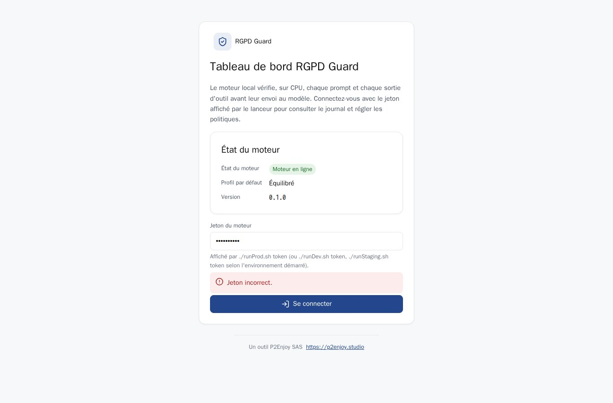
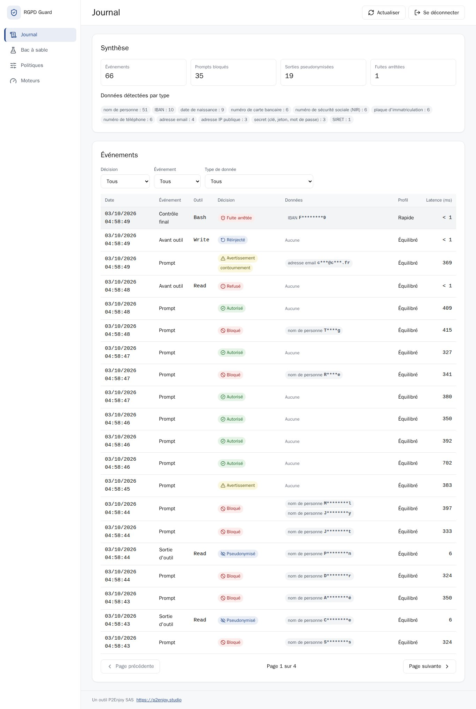
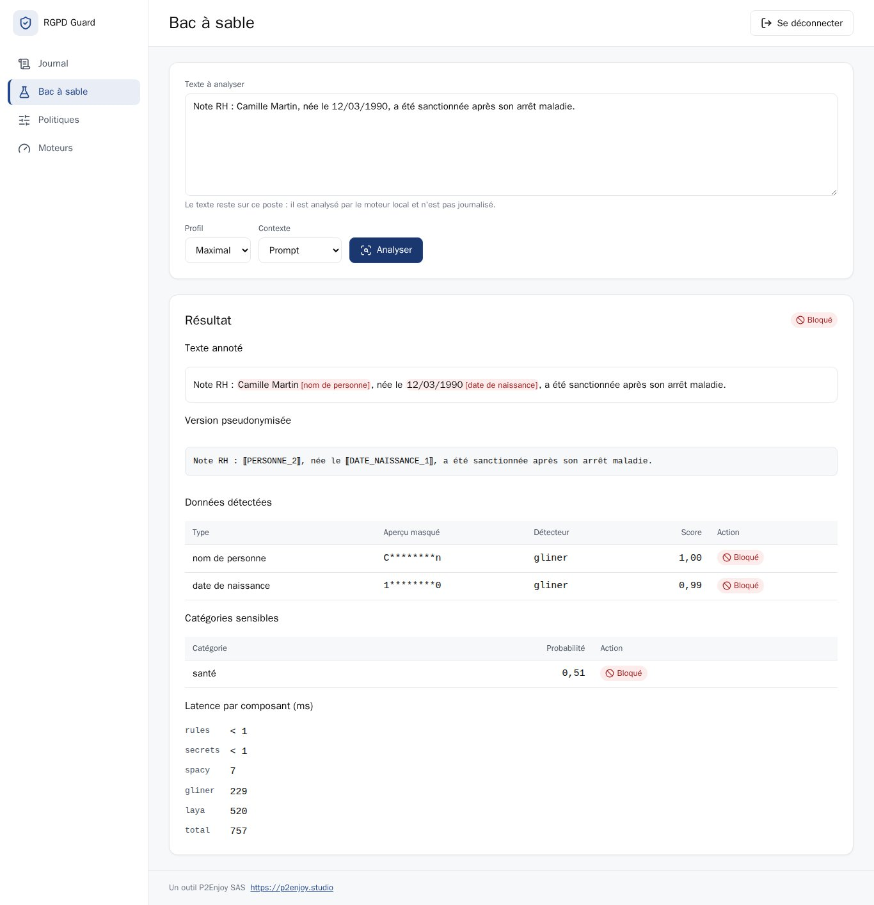
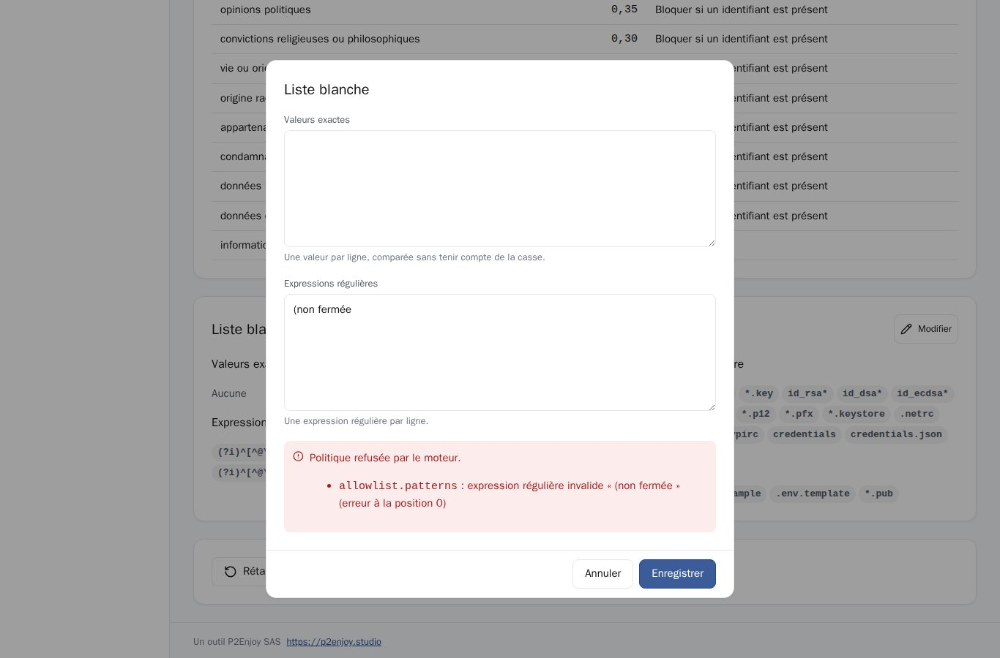
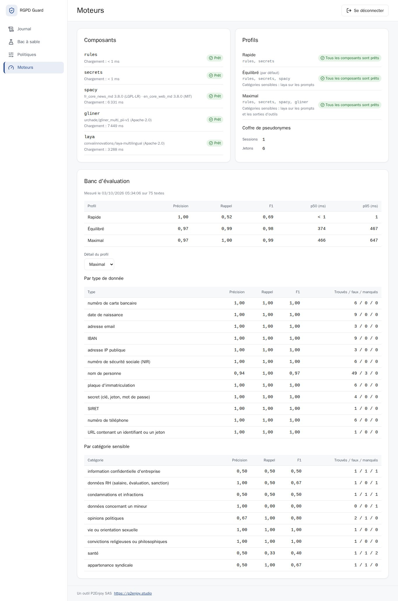

# Manuel d'utilisation de RGPD Guard

RGPD Guard est un outil P2Enjoy SAS. Ce manuel s'adresse à la personne qui utilise Claude Code avec le plugin : il décrit ce qui se passe à l'écran, comment réagir et comment régler l'outil. L'architecture est décrite dans le [DAT](DAT.md).

## 1. Ce que fait RGPD Guard

Avant qu'un prompt ou une sortie d'outil ne parte vers le modèle, un moteur local, exécuté sur le processeur de votre poste, y cherche :

- des données personnelles : noms, adresses email, téléphones, IBAN, numéros de carte, NIR, SIREN et SIRET, adresses IP publiques, plaques d'immatriculation, dates de naissance, adresses postales ;
- des secrets : clés d'API, jetons, clés privées, mots de passe affectés dans un fichier ou inscrits dans une URL ;
- des URL porteuses d'un jeton de partage opaque (lien de document, d'invitation) ;
- des catégories sensibles au sens de l'article 9 du RGPD et voisines : santé, opinions politiques, convictions, orientation sexuelle, origine, appartenance syndicale, condamnations, données RH, mineurs, informations confidentielles.

Selon la situation, il bloque le prompt, remplace les valeurs par des jetons ou se contente d'avertir. Rien n'est envoyé à un service externe pour faire cette analyse.

## 2. Installation

Prérequis : Docker avec Compose v2, Git et Claude Code.

1. Cloner le dépôt et démarrer le moteur de production :

   ```bash
   git clone https://github.com/martinobettucci/rgpd-guard.git
   cd rgpd-guard
   ./runProd.sh up
   ```

   Au premier démarrage, le lanceur génère un jeton et une clé de journal, construit les images (modèles inclus, environ 2 Go) puis attend que le moteur soit prêt. Il écrit l'adresse et le jeton du moteur dans `~/.config/rgpd-guard/engine.env` (lisible par vous seul) : le plugin les y trouve sans réglage.

2. Installer le plugin dans Claude Code :

   ```text
   /plugin marketplace add martinobettucci/rgpd-guard
   /plugin install rgpd-guard@p2enjoy
   ```

3. Vérifier avec `/rgpd-guard:status` : Claude résume l'état du moteur, le profil actif et les composants éventuellement indisponibles.

Options du plugin, modifiables dans `/config` :

| Option | Effet | Défaut |
|---|---|---|
| `engine_url` | adresse du moteur | celle du dernier environnement démarré, sinon `http://127.0.0.1:8742` |
| `engine_token` | jeton du moteur (stockage sécurisé) | celui du dernier environnement démarré |
| `fail_mode` | `closed` : tout est bloqué si le moteur ne répond pas ; `open` : simple avertissement | `closed` |
| `profile` | `defaut` (profil du moteur), `rapide`, `equilibre` ou `max` | `defaut` |

Le moteur lit votre dossier personnel en lecture seule, pour analyser les fichiers mentionnés par `@` et ceux passés à `/rgpd-guard:scan`. Pour limiter ce périmètre : `RGPD_GUARD_WORKSPACE_ROOT=/chemin/des/projets ./runProd.sh up`.

## 3. Au quotidien dans Claude Code

### 3.1 Prompt bloqué

Quand un prompt contient une donnée à protéger, il n'est pas envoyé. Vous voyez un message de cette forme :

```text
RGPD Guard a bloqué ce prompt avant son envoi au modèle.

Détecté dans le prompt :
  • IBAN (1) : F********9

Version pseudonymisée, prête à copier :
8<------------------------------
Vire 100 euros sur ⟦IBAN_1⟧ stp
8<------------------------------
Les jetons ⟦...⟧ sont réinjectés localement si Claude les écrit dans un fichier ; le modèle ne voit jamais les vraies valeurs.
Pour envoyer malgré tout (hors secrets), commencez le prompt par #rgpd-ok.
```

Trois réponses possibles :

- copier la version pseudonymisée et l'envoyer : Claude travaille sur les jetons ;
- reformuler sans la donnée ;
- envoyer malgré tout en commençant le prompt par `#rgpd-ok`. Le contournement est journalisé et ne fonctionne jamais pour un secret.

Une catégorie sensible (par exemple la santé) associée à un identifiant direct (nom, email, téléphone, NIR) bloque aussi le prompt. Sans identifiant, elle produit un simple avertissement.

### 3.2 Avertissement

Pour les types que la politique classe en avertissement, le prompt part et un message `RGPD Guard (avertissement, prompt envoyé) : …` en rappelle le contenu détecté.

### 3.3 Fichiers mentionnés par `@`

Claude Code envoie le contenu d'un fichier mentionné par `@chemin` tel quel, sans passer par un outil. RGPD Guard analyse donc ce fichier au moment du prompt et bloque si nécessaire. Il bloque aussi un fichier qu'il ne peut pas analyser : hors du dossier lisible, binaire (image, PDF) ou trop volumineux. Dans ces cas, retirez la mention et demandez plutôt à Claude de lire le fichier : la sortie de l'outil de lecture sera pseudonymisée.

### 3.4 Lectures et sorties d'outils

Quand Claude lit un fichier ou exécute une commande, les valeurs détectées dans le résultat sont remplacées par des jetons `⟦TYPE_N⟧` avant d'atteindre le modèle, par exemple `⟦EMAIL_1⟧` ou `⟦PERSONNE_2⟧`. Une même valeur reçoit toujours le même jeton pendant la session. Claude est informé au démarrage de la session que ces jetons sont des pseudonymes à conserver tels quels.

### 3.5 Écritures : réinjection des vraies valeurs

Quand Claude écrit un fichier (Write, Edit, MultiEdit, NotebookEdit) avec des jetons, RGPD Guard les remplace localement par les vraies valeurs avant l'écriture : le fichier sur disque est correct, le modèle n'a jamais vu les valeurs. Les correspondances vivent uniquement en mémoire du moteur, le temps de la session (12 heures par défaut).

Un Edit dont le texte à remplacer contient lui-même un jeton échoue : Claude Code compare ce texte au fichier réel avant toute réinjection. Claude en est informé et choisit un texte voisin ou réécrit le fichier entier.

Un jeton inconnu (moteur redémarré, session expirée) est refusé : Claude doit relire le fichier source pour obtenir des jetons valides.

### 3.6 Fichiers de secrets

La lecture des fichiers de secrets est refusée : `.env` et `.env.*`, clés et certificats (`*.pem`, `*.key`, `id_rsa*`, `*.p12`…), coffres de mots de passe (`*.kdbx`), `.netrc`, `.pgpass`, `.npmrc`, `.pypirc`, `credentials`. Claude reçoit un message lui demandant de vous poser la question des seules informations non sensibles dont il a besoin. La liste des motifs se règle dans le tableau de bord (Politiques, Fichiers secrets).

### 3.7 Filet final

Juste avant l'envoi au modèle, RGPD Guard relit le contenu complet des résultats d'outils. S'il y reste une donnée qui n'a pas pu être masquée (par exemple dans la sortie d'une commande en échec), il arrête la boucle. Le résultat reste dans la conversation locale : utilisez `/rewind` (ou deux fois Échap) pour revenir avant cet appel d'outil avant de continuer.

### 3.8 Moteur arrêté

Avec `fail_mode=closed` (défaut), un moteur injoignable, en erreur ou trop lent bloque les prompts et refuse les outils : aucune donnée ne part sans contrôle. Relancez le moteur avec `./runProd.sh up`. Avec `fail_mode=open`, un avertissement s'affiche et le travail continue sans protection.

## 4. Commandes du plugin

| Commande | Effet |
|---|---|
| `/rgpd-guard:status` | état du moteur, profil actif, composants indisponibles |
| `/rgpd-guard:scan <fichier>` | nombre de données sensibles par type dans un fichier du dossier lisible, sans jamais en révéler la valeur au modèle |
| `/rgpd-guard:dashboard` | adresse du tableau de bord et commande qui affiche le jeton |

## 5. Tableau de bord

Adresse : http://127.0.0.1:8743 (staging : http://127.0.0.1:18743). Le tableau de bord n'est joignable que depuis votre poste.

### 5.1 Accueil et connexion

L'accueil indique si le moteur est en ligne et son profil par défaut. Connectez-vous avec le jeton affiché par `./runProd.sh token` (ou `./runDev.sh token`, `./runStaging.sh token` selon l'environnement démarré). La session ne survit pas à la fermeture du navigateur ; « Se déconnecter » la ferme immédiatement.



### 5.2 Journal

Le journal liste chaque événement traité : prompt, avant outil, sortie d'outil, échec d'outil, contrôle final, avec la décision, le profil, la latence et les types détectés. Aucune valeur n'y est conservée : seul un aperçu masqué (au plus deux caractères d'origine) l'accompagne. Les filtres portent sur la décision, l'événement et le type de donnée ; la synthèse compte les prompts bloqués, les sorties pseudonymisées et les fuites arrêtées par le filet final. Les événements sont purgés après 30 jours par défaut.



### 5.3 Bac à sable

Le bac à sable analyse un texte saisi sans rien journaliser : texte annoté, version pseudonymisée, données détectées avec leur détecteur et leur score, catégories sensibles, latence de chaque composant. Choisissez le profil et le contexte (prompt ou sortie d'outil) pour voir la décision qui serait prise.



### 5.4 Politiques

La politique décide, pour chaque type de donnée, de l'action sur un prompt (bloquer, avertir, autoriser) et sur une sortie d'outil (pseudonymiser, autoriser), avec un score minimal ; pour chaque catégorie sensible, d'un seuil et d'une action. Elle porte aussi la liste blanche (valeurs exactes et expressions régulières jamais signalées) et les motifs de fichiers secrets.

Chaque section se modifie dans sa propre fenêtre (« Modifier »). Le moteur valide la politique : une valeur refusée est signalée dans la fenêtre, avec le champ fautif, sans perdre votre saisie. « Rétablir la politique par défaut » demande une confirmation.



### 5.5 Moteurs

La page Moteurs montre chaque composant, son état, ses modèles et leur licence, son temps de chargement ; les composants de chaque profil ; l'occupation du coffre de pseudonymes ; le dernier banc d'évaluation (précision, rappel, F1 et latences par profil, détail par type et par catégorie). Le banc se mesure sur la pile de développement (`./runDev.sh bench`) : dans les autres environnements, la page l'indique.



## 6. Profils

| Profil | Détecteurs | Usage | Mesure (banc de 75 textes, 4 vCPU) |
|---|---|---|---|
| Rapide | règles et secrets | identifiants structurés seulement, aucun nom de personne | F1 0,69, moins de 1 ms |
| Équilibré (défaut) | Rapide, spaCy, Laya sur les prompts | usage courant | F1 0,98, 374 ms (p50) |
| Maximal | Équilibré, GLiNER, Laya aussi sur les sorties d'outils | données très sensibles | F1 0,986, 466 ms (p50) |

Le profil par défaut se règle côté moteur (`RGPD_GUARD_PROFILE`), et pour Claude Code seulement par l'option `profile` du plugin.

## 7. Dépannage

| Symptôme | Cause probable | Action |
|---|---|---|
| Tous les prompts sont bloqués : « RGPD Guard : moteur injoignable (…). Le prompt n'a pas été envoyé. » | moteur arrêté ou en démarrage | `./runProd.sh up`, puis `/rgpd-guard:status` |
| « Jeton incorrect » à la connexion du tableau de bord | jeton d'un autre environnement | relancer `./runProd.sh token` (ou le lanceur de l'environnement démarré) |
| `/rgpd-guard:status` signale un profil incomplet | un composant à modèle n'a pas pu se charger | page Moteurs : l'erreur du composant y est affichée ; la détection continue avec les autres |
| Un Edit de Claude échoue sur un jeton | texte à remplacer contenant un jeton | laisser Claude choisir un autre texte ou réécrire le fichier |
| La boucle s'arrête après une commande | filet final | `/rewind`, puis reformuler la demande |

## 8. Limites connues

- En profil Rapide, les noms de personnes en texte libre ne sont pas détectés.
- Un jeton de partage entièrement en minuscules n'est pas reconnu dans une URL ; dans `utilisateur:motdepasse@hôte`, seul le mot de passe est masqué.
- Catégories sensibles : rappel mesuré de 60 % et précision de 64 %, aucune reconnaissance des données concernant un mineur. C'est une couche complémentaire, pas une garantie.
- Ne passent par aucun contrôle : les images collées, les contenus que Claude Code injecte sans hook (CLAUDE.md, mémoire, état git, sortie des commandes `!` dans une commande slash), la télémétrie de Claude Code (désactivable avec `DISABLE_TELEMETRY=1`) et le contenu analysé côté serveur par WebFetch.

## 9. Données conservées

- Journal : type, détecteur, score, décision, empreinte HMAC et aperçu masqué de chaque valeur, jamais la valeur ni le prompt. Rétention de 30 jours par défaut.
- Coffre de pseudonymes : en mémoire seulement, effacé au redémarrage du moteur et à l'expiration de la session.
- Tableau de bord : aucune donnée dans le navigateur, hormis le cookie de session posé par le moteur.

https://p2enjoy.studio
